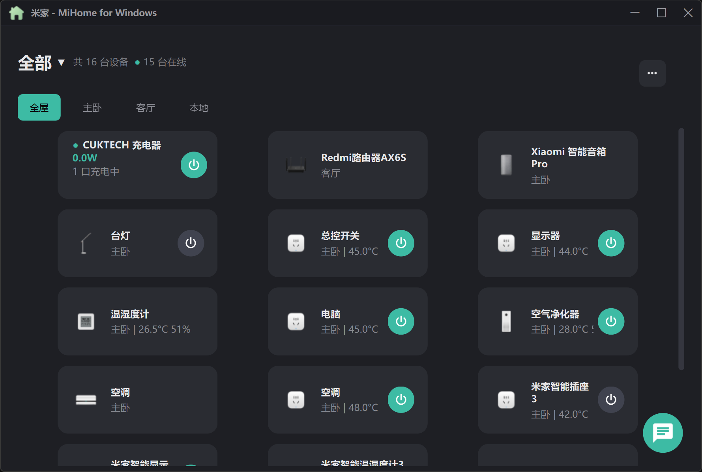
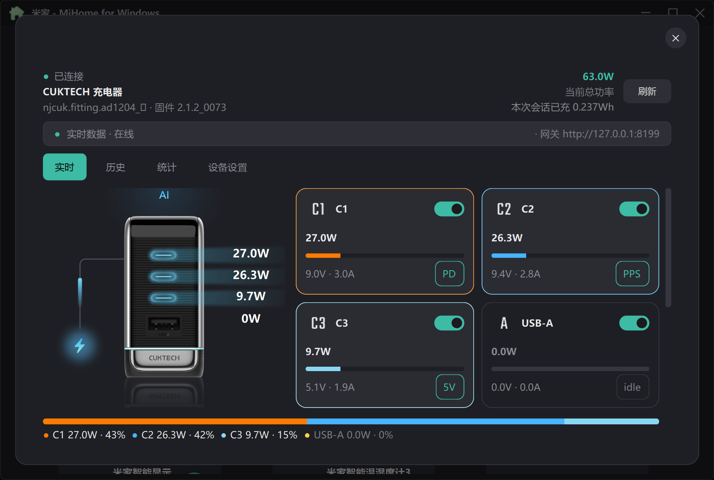

<div align="center">

# MiHome-Ex

**米家设备的 Windows 桌面控制端（扩展版）**

基于 [mijiaAPI](https://github.com/Do1e/mijia-api) 构建图形界面，扫码登录后即可在本地窗口中查看和控制家里的全部米家设备。
由 [huanyuejue/MiHome-Windows](https://github.com/huanyuejue/MiHome-Windows) fork 改造而来，并集成了 [kairui1108/cuktech-ble-server](https://github.com/kairui1108/cuktech-ble-server)（[本 fork 维护版](https://github.com/Arimayuki03/cuktech-ble-server)） 作为本地 BLE 数据源。

[](https://github.com/Arimayuki03/MiHome-Ex/releases/latest)
[](https://github.com/Arimayuki03/MiHome-Ex/actions/workflows/ci.yml)
[](LICENSE)
[](https://github.com/Arimayuki03/MiHome-Ex)
[](https://www.python.org/)
[](https://www.qt.io/)
[](https://github.com/Arimayuki03/MiHome-Ex/issues)
[](https://github.com/Arimayuki03/MiHome-Ex/stargazers)

**[下载最新版](https://github.com/Arimayuki03/MiHome-Ex/releases/latest) · [功能一览](#-功能) · [快速开始](#-快速开始) · [构建](#-构建可执行文件) · [参与贡献](#-参与贡献)**



</div>

---

> [!IMPORTANT]
> 当前项目仍处于早期版本。作者个人米家设备有限，无法对各类设备做针对性适配测试，UI 和操作逻辑的完善度不算很高。基础使用（扫码登录、设备列表与常用控制、托盘、小爱语音等）已无大碍，适配更多设备功能则需要社区支持。
>
> 本程序与小米官方无关，不含任何担保，请自行承担使用风险，并遵守小米的服务条款。

## ✨ 功能

### 米家设备控制（继承自上游）

- **扫码登录**：米家 APP 扫二维码，登录凭据与上游依赖的 CLI 共用
- **设备列表**：按家庭、房间分组，实时显示在线状态，支持隐藏无功能设备
- **设备控制**：根据设备 spec 元数据自动生成控件——布尔属性映射开关、数值属性映射滑块（自动套用范围与步长）、枚举属性映射下拉框
- **动作执行**：设备支持的动作渲染为按钮，执行前二次确认
- **系统托盘**：最小化到托盘，支持快捷设备控制、小爱音响快捷控制、小爱语音指令，托盘快捷窗口支持单列/双列卡片切换
- **主题配色**：深色 / 浅色 / 跟随系统（米家绿主题色两种模式一致）；托盘图标自动跟随 Windows 任务栏深浅色
- **界面缩放**：50%–200% 无级调节（叠加在系统缩放之上），需重启生效
- **开机自启动**：可选，写入当前用户注册表（HKCU Run）
- **小爱语音**：主界面右下角悬浮按钮，输入文字指令发送给在线小爱音箱，可指定默认输出音箱
- **版本检测**：启动时自动检查 GitHub Releases 新版本，也可在关于页手动检测

### CUKTECH 充电器本地控制（本 fork 扩展）

通过内置 BLE 服务端（扩展组件，随主程序启停）经蓝牙/局域网直连 [CUKTECH（酷态科）10 Ultra 充电器](https://github.com/Arimayuki03/cuktech-ble-server)，数据不经过米家云端：



- **专用设备卡片与实时面板**：总功率、四口（C1/C2/C3/A）逐口功率、端口开关，SSE 推送实时更新、轮询兜底
- **充电器一键登录**：复用米家扫码会话自动提取蓝牙凭据写入内置服务端，免去二次扫码（设置 → 应用功能）
- **设备渲染舞台**：深浅色主题的充电器底图 + 端口模式图标（AI/均衡/单口/Mac 快充），可视化当前充电状态
- **充电限额与延时关闭**：按口设置充到指定 Wh 自动断电（一次性/永久），快捷档 5/10/15/20/25 Wh
- **充电会话历史**：会话列表筛选与翻页、单会话点级曲线（五项指标 + 快充协议标注）与 CSV 导出
- **能量统计**：按端口/每小时/快充协议三维度统计图表
- **托盘悬停弹窗**：托盘图标悬停即显示四口功率与总功率
- **写路径竞态防护**：端口开关/会话列表/托盘音量等异步链路全面引入请求序号与 pending 守卫，飞行中切换设备/筛选不会串台或回跳
- **写命令确认与自愈重试**：端口开关要求设备 Result 确认（仅 ACK 不算成功），未确认自动重试一轮并重读基线自愈，消除「UI 报错、设备实际已开/关」与开关回跳

## 🚀 快速开始

### 方式一：下载安装包（推荐）

前往 [Releases](https://github.com/Arimayuki03/MiHome-Ex/releases/latest) 下载：

| 文件 | 说明 |
|------|------|
| `MiHome-Ex-setup-<版本>.exe` | Inno Setup 安装包，双击安装，支持开机自启动 |
| `MiHome-Ex-<版本>-x64-portable.zip` | 免安装绿色版，解压即用 |

> 安装包/绿色版均内置 BLE 服务端扩展组件；不装也能用，充电器功能按组件缺失静默缺席。

### ❓ 杀毒软件报毒（误报说明）

程序使用 **[Nuitka](https://nuitka.net/)** 将 Python 源码编译为原生可执行文件（详见[构建](#-构建可执行文件)），且**尚未做代码签名**。这类未签名的编译型 exe 常被 360、火绒、Windows Defender 等的机器学习引擎误判（如 360 的 `HEUR/QVM....Malware.Gen`），属已知误报模式。

> [!TIP]
> **自行验证文件是否被篡改**：每个 Release 都附 `SHA256SUMS.txt`，下载后执行
> `Get-FileHash <文件路径> -Algorithm SHA256` 比对即可；官方构建的哈希与清单一致。
> 也可将文件上传 [VirusTotal](https://www.virustotal.com/) 查看——本项目如果被少量引擎（尤其 QVM/HEUR 类启发式）命中而主流引擎（Defender、卡巴、ESET 等）全绿，即为典型误报。

若信任来源、希望继续使用，将安装目录加入杀软**信任区/白名单**即可：

<details>
<summary>360 安全卫士操作路径</summary>

1. 弹窗时选择「信任该文件」；若已自动隔离，先到「木马查杀 → 恢复区」恢复并勾选「信任」
2. 或手动添加：设置 → 安全操作中心 → 信任区 → 添加目录 → 选择安装目录（默认 `C:\Users\<用户名>\AppData\Local\Programs\MiHome-Ex\`）
3. 添加后重新运行程序

</details>

<details>
<summary>Windows Defender 操作路径</summary>

1. Windows 安全中心 → 病毒和威胁防护 → 管理设置 → 排除项 → 添加排除项
2. 选择「文件夹」→ 添加安装目录（或「进程」→ 添加 `MiHome-Ex.exe`）

</details>

> 长期方案是购买代码签名证书（EV 证书可直接消除大部分信誉类误报），在项目获得赞助前暂无计划；如报毒持续困扰，欢迎在 [Issues](https://github.com/Arimayuki03/MiHome-Ex/issues) 反馈你使用的杀软与判定名，便于针对性提交误报申诉。

### 方式二：源码运行

要求 Python >= 3.10。

```powershell
git clone https://github.com/Arimayuki03/MiHome-Ex.git
cd MiHome-Ex

# 双击 start.bat，或命令行执行：
start.bat
```

`start.bat` 自动完成：创建 venv → 安装依赖 → 启动程序，无需手动配置环境。

<details>
<summary>手动运行</summary>

```powershell
git clone https://github.com/Arimayuki03/MiHome-Ex.git
cd MiHome-Ex

python -m venv .venv
.venv\Scripts\pip install -e .
.venv\Scripts\python.exe run.py
```

</details>

> [!TIP]
> 首次启动会弹出扫码窗口；之后凭据长期复用，失效时再次扫码即可。
> 充电器功能的开发态联调需另行 clone [cuktech-ble-server](https://github.com/Arimayuki03/cuktech-ble-server) 到同级目录，详见其仓库说明。

## 🧱 构建可执行文件

项目使用 **[Nuitka](https://nuitka.net/)** 将 Python 源码编译打包为原生 Windows 可执行文件（standalone 模式：把 Python 解释器、全部依赖与资源文件整合进一个免安装目录，最终产出 `dist\MiHome-Ex.exe`）。Nuitka 是真编译器——把代码编译为 C 再编译为机器码，而非 PyInstaller 式的"打包字节码"，这也是需要 VS Build Tools 的原因。

### 前置条件

| 工具 | 版本 | 说明 |
|------|------|------|
| Python | >= 3.10 | 需加入系统 PATH，构建脚本会自动创建 venv |
| VS Build Tools | 2022 | Nuitka 编译所需的 C 编译器，约 2 GB |

下载安装 VS Build Tools 2022：https://visualstudio.microsoft.com/downloads/#build-tools-for-visual-studio-2022

安装时勾选 **"使用 C++ 的桌面开发"** 工作负载。

### 一键构建

```powershell
git clone https://github.com/Arimayuki03/MiHome-Ex.git
cd MiHome-Ex

# 双击 build_msvc.bat 或运行：
.\build.ps1
```

脚本自动完成：创建 venv → 安装依赖（含 Nuitka 本体）→ 激活 MSVC 编译环境 → Nuitka 编译主程序 → Nuitka 编译内置 BLE 服务端 → 输出到 `dist/`。

构建参数（打包资源清单、图标、排除项等）集中维护在 `build.ps1` 的 `$NuitkaArgs`；`build_msvc.bat` 只是转发到它的双击入口。安装包用 Inno Setup 编译 `installer\MiHome-Ex.iss`（版本号单一信源为 `installer\version.ini`）。

首次构建耗时较长（创建 venv + 下载依赖 + Nuitka 编译，通常 5–15 分钟，视机器而定）。

## 📁 项目结构

```
app/
├── core/                       # 核心层
│   ├── service.py              # mijiaAPI 适配层，全项目唯一 import mijiaAPI 的模块
│   ├── jobs.py                 # 串行任务队列，所有米家网络调用的后台通道
│   ├── models.py               # 数据模型
│   ├── cuktech_client.py       # CUKTECH 充电器 HTTP 客户端（经 jobs 队列）
│   ├── cuktech_credentials.py  # 充电器云端凭据提取（M5 统一登录）
│   ├── cuktech_events.py       # CUKTECH SSE 实时事件流
│   ├── ble_server_manager.py   # 内置 BLE 服务端子进程生命周期管理
│   ├── _json_store.py          # JSON 持久化公共基础（数据目录/迁移/原子写）
│   ├── cache.py                # 设备缓存
│   ├── settings_store.py       # 应用设置持久化（含开机自启动注册表）
│   ├── tray_store.py           # 托盘配置持久化
│   ├── workbench_store.py      # 工作台配置持久化
│   ├── icon_store.py           # 设备图标获取与缓存
│   ├── update_checker.py       # GitHub Releases 新版本检查（后台线程 + 信号）
│   └── restart.py              # 应用自重启（缩放等设置需重启生效时一键重启）
├── ui/                         # 界面层
│   ├── main_window.py          # 主窗口（无边框标题栏）
│   ├── cuktech_panel.py        # CUKTECH 充电器卡片 + 详情面板（实时页）
│   ├── cuktech_history.py      # 充电会话历史 + 能量统计
│   ├── cuktech_limits.py       # 充电限额 + 延时关闭
│   ├── cuktech_stage.py        # 充电器渲染舞台与端口卡网格
│   ├── cuktech_visuals.py      # 多指标曲线等可视化件
│   ├── cuktech_port_detail.py  # 单口详情弹窗
│   ├── cuktech_protocols.py    # 快充协议显示
│   ├── cuktech_quality.py      # 数据质量指示
│   ├── tray/                   # 系统托盘
│   │   ├── quick_window.py     #   快捷控制面板（单列/双列卡片）
│   │   ├── cuktech_hover.py    #   充电器托盘悬停功率弹窗
│   │   ├── audio_bar.py        #   音响控制栏
│   │   ├── controller.py       #   托盘控制器
│   │   └── manager_dialog.py   #   托盘设备管理对话框
│   ├── device_card.py          # 设备卡片组件
│   ├── device_dialog.py        # 设备详情对话框
│   ├── workbench_panel.py      # 工作台面板（属性/动作）
│   ├── workbench_item.py       # 工作台属性/动作项
│   ├── prop_widgets.py         # 属性控件（开关、滑块、下拉框）
│   ├── power_button.py         # 三态电源按钮（卡片/托盘/详情共用）
│   ├── overlay_dialog.py       # 遮罩对话框基类（详情/设置/抽屉共用）
│   ├── about_dialog.py         # 关于对话框（版本信息、手动检测更新）
│   ├── settings_dialog.py      # 设置对话框（主题界面/应用功能双分类）
│   ├── voice_fab.py            # 语音悬浮球
│   ├── toast.py                # 轻量通知浮层
│   ├── update_flow.py          # 版本检查界面流程（弹框提示/静默反馈）
│   ├── login_dialog.py         # 扫码登录对话框
│   ├── add_drawer.py           # 设备添加抽屉
│   ├── typewriter.py           # 打字机效果组件
│   ├── si_theme.py             # 主题中枢（深/浅调色板 + 全局 QSS 生成）
│   ├── theme_service.py        # 主题编排（跟随系统/浅色/深色）
│   ├── assets/                 # CUKTECH 充电器渲染素材
│   ├── icon.ico / icon.png     # 应用图标
│   └── tray_icon.png / tray_icon_light.png  # 托盘图标
├── siui/                       # 内置 SiliconUI 组件库（GPL-3.0）
│   ├── components/             # UI 组件
│   ├── core/                   # 核心工具
│   └── gui/                    # 图形工具
└── __init__.py                 # 版本号 + 工具函数

tests/                          # 接口兼容性自检 / 主题回归 / CUKTECH 面板测试
run.py                          # 程序入口
start.bat                       # Windows 一键运行（双击运行）
build_msvc.bat                  # Windows 一键构建（双击运行，转发 build.ps1）
build.ps1                       # PowerShell 构建脚本（Nuitka 参数唯一来源）
installer/                      # Inno Setup 安装包工程
pyproject.toml                  # 项目配置
LICENSE                         # GPL-3.0 许可证
```

## 💾 本地缓存与数据存储

程序运行时会在以下位置生成配置和缓存文件，方便用户备份或排查问题：

### 应用数据（Releases 版）

路径：`%LOCALAPPDATA%\MiHome-Ex\`

| 文件/目录 | 说明 |
|------|------|
| `settings.json` | 应用设置（主题、缩放、托盘、自启动等） |
| `tray.json` | 托盘快捷控制面板的设备列表配置 |
| `workbench.json` | 工作台（设备详情页）的自定义布局 |
| `devices_cache.json` | 设备列表与状态缓存，启动时优先从缓存加载以加快首屏显示 |
| `ble-server/` | 内置 BLE 服务端数据（`config.yaml`、充电历史 `port_history.db`） |

> 路径中的 `%LOCALAPPDATA%` 通常为 `C:\Users\<用户名>\AppData\Local`。
> 旧位置（exe 同目录、旧项目名 `MiHome-Windows\`）的已有数据会在首次启动时自动迁移，无需手动处理。

### 应用数据（源码模式）

路径：项目根目录（与 `run.py` 同级），文件名与 Releases 版一致。

### 米家账号登录凭据

路径：`~/.config/mijia-api/auth.json`

这是 mijiaAPI 的认证文件，扫码登录后长期复用。失效时程序会自动提示重新扫码。

> 路径中的 `~` 在 Windows 上为 `C:\Users\<用户名>`。

## 🔒 隐私说明

- 本程序**不上传任何数据**：米家通信经 mijiaAPI 直连小米服务，CUKTECH 充电器数据走本机蓝牙/局域网（`127.0.0.1`），全部不出本机
- 唯一的对外请求是**版本检测**（访问 GitHub API 拉取最新 Release），可在设置中忽略提示
- 认证文件、设备缓存、充电历史均只保存在本机用户目录，卸载也不会自动删除，可自行清理

## 📦 依赖说明

| 包名 | 版本 | 用途 |
|------|------|------|
| mijiaAPI | >=4.2,<5 | 米家 API 封装 |
| PySide6 | >=6.7 | Qt6 绑定 |
| qrcode | >=8 | 登录二维码生成 |
| qtawesome | >=1.4 | Material Design 图标 |
| requests | - | CUKTECH 充电器本地 HTTP / 版本检测 |
| numpy | - | SiliconUI 动画插值 |
| typing_extensions | - | SiliconUI 在 Python 3.10 下所需的类型别名 |

## 🤝 参与贡献

欢迎 Issue 与 PR！

1. Fork 本仓库并创建特性分支（`git checkout -b feat/xxx`）
2. 提交更改（`git commit -m "feat: xxx"`）
3. 推送到分支（`git push origin feat/xxx`）并发起 Pull Request

适配了新设备、修了 Bug，欢迎在 [Issues](https://github.com/Arimayuki03/MiHome-Ex/issues) 反馈。

### 开发与 CI

- 推送 / PR 自动运行测试套件（核心 + UI 离屏渲染，Python 3.10 / 3.12 双矩阵），见 [.github/workflows/ci.yml](.github/workflows/ci.yml)
- 打 `v*` 标签自动触发完整构建（Nuitka 主程序 + 内置 BLE 服务端 → Inno Setup 安装包 + 便携版 zip）并发布 Release，产物附 SHA-256 校验和
- 本地验证：`python tests/xxx_test.py` 逐套运行，或 `python -m tests.smoke_test` 做 mijiaAPI 兼容自检

## 📄 开源许可

本项目基于 [GPL-3.0](LICENSE) 或更高版本发布。

### 致谢

本程序使用了以下开源组件，在此向原作者致谢：

| 项目 | 协议 | 说明 |
|------|------|------|
| [huanyuejue/MiHome-Windows](https://github.com/huanyuejue/MiHome-Windows) | GPL-3.0 | 本项目 fork 的上游 |
| [mijia-api](https://github.com/Do1e/mijia-api) | GPL-3.0 | 米家 API 封装 |
| [PySide6-SiliconUI](https://github.com/H1DDENADM1N/PySide6-SiliconUI) | GPL-3.0 | UI 组件库（已内置至 `app/siui/`） |
| [kairui1108/cuktech-ble-server](https://github.com/kairui1108/cuktech-ble-server) | MIT | CUKTECH 充电器 BLE 服务端（内置为扩展组件；本仓库另有[维护 fork](https://github.com/Arimayuki03/cuktech-ble-server)） |

对本项目代码的使用、修改与分发同样须遵循 GPL-3.0。

<div align="center">

**如果这个项目对你有帮助，欢迎点个 Star ⭐**

</div>
